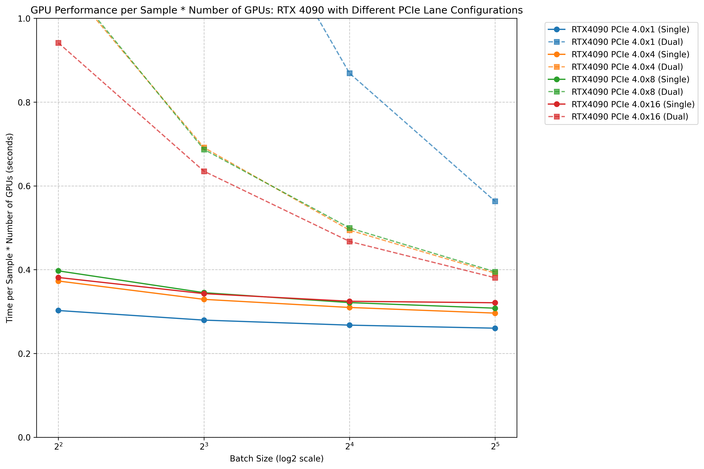
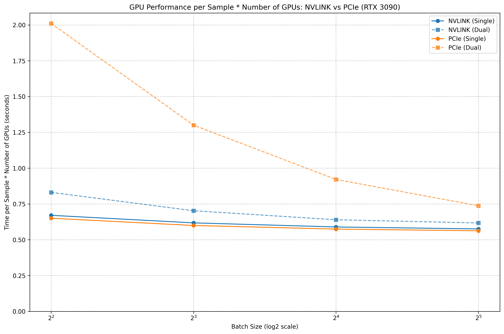

# GPU Communication Benchmark Results: PCIe vs NVLINK

TLDR: I run a bunch of experiments of DDP training with different communication methods between GPUs and here are the results.

1. NVLINK is generally so much better than PCIe for training, even at 16x channels.

2. PCIe 1x is absolute garbage for training. but 4/8/16 is decent at a large batch size

3. Go look at the plots i made.

I have been trying to figure out what kind of communication I absolutely need for my GPU rig. So I measured DDP training throughput for different number of PCIe 4.0 channels in 2x4090 and comparing PCIe vs. NVLINK in 2x3090 in DDP training of diffusion models. I run everything on vast.ai instances.

The setting I used might be somewhat different from the "Local LLama"-specific needs, but I think it will still be relevant for many of you.

- Training only. These experiments do not necessarily say that much about inference efficiency.

- DDP Distributed approach. Meaning the whole model fits onto each gpu, forward pass and backward pass computed independently. After, the gradients are synchronised (this is where the communication bottleneck can happen) and finally we take an optimizer step. This should be the least communication-intensive method.

- SDXL diffusion training. This is an image generation model but you should have similar results with training LLMs of similar size (this one is 2.6B )

- Overall I believe these experiments are useful to anyone who wants to train or fine-tune using multiple 3090/4090s. I used DDP only, this is the parallelism with the least communication overhead so this implies that if communication speed matters for DDP training, it matters for any kind of distributed training.

I am reporting the batch time / batch size * #GPUs. I expect the single GPU to be optimal in this metric since there is no communication overhead and by multiplying by number of GPUs there is no advantage in number of flops in this metric. The question is how close can we get to single-gpu efficiency via dual-gpu.

Because DDP syncronizes gradients once per batch, the larger the batch size the longer forward/backward will take and the less relative importance will the communication overhead have. For the record this is done by accumulating gradients over minibatches, with no synchronization between gpus until the whole batch is done.

Now the promised plots.

First results. PCIe speed matters. 1x is really bad, the difference between 4x, 8x, 16x is small when we increase batch size

r/LocalLLaMA - Benchmark results: PCIe4.0 1x/4x/8x/16x/NVLINK 3090/4090
Ideally, for single GPU training, the PCIe speed should not matter, I attribute the differences to potential undervolting of the GPU by certain cloud providers or perhaps other system differences between servers. I am also not sure why there is not so much difference between 8x and 4x. Maybe different PCIe topology or something? Or perhaps different system specs that I did not measure can impact the communication speed.

Second set of results.

NVLINK is so much better than PCIe

r/LocalLLaMA - Benchmark results: PCIe4.0 1x/4x/8x/16x/NVLINK 3090/4090
These results are for 3090 not 4090 bc NVLINK is not available. For reference the orange line of the second plot would somewhat correspond to the red line of the first plot (PCIe 16x). The closer to the single-gpu lines the better and NVLINK get really close regardless of batch size, much more than PCIEe 16x. This points out the importance of NVLINK. Also I don't think you can connect more than 2 3090 at the same time with NVLINK so that is unfortunate :)

The code I used to run the experiments is here: https://github.com/benoriol/diffusion_benchmark/blob/main/train_sdxl_DDP.sh

follow at https://x.com/benetnu :)